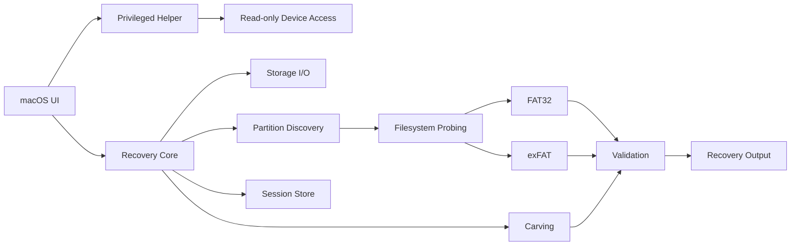
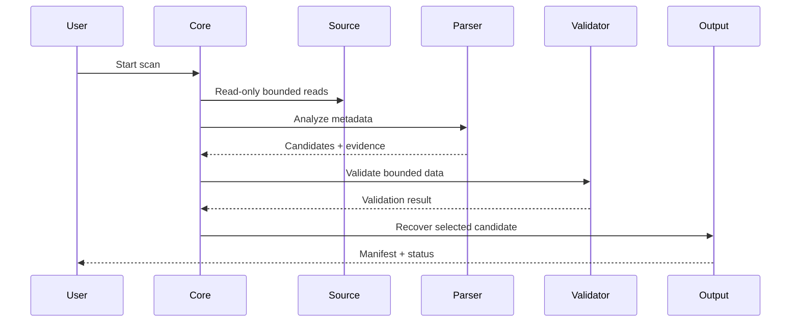
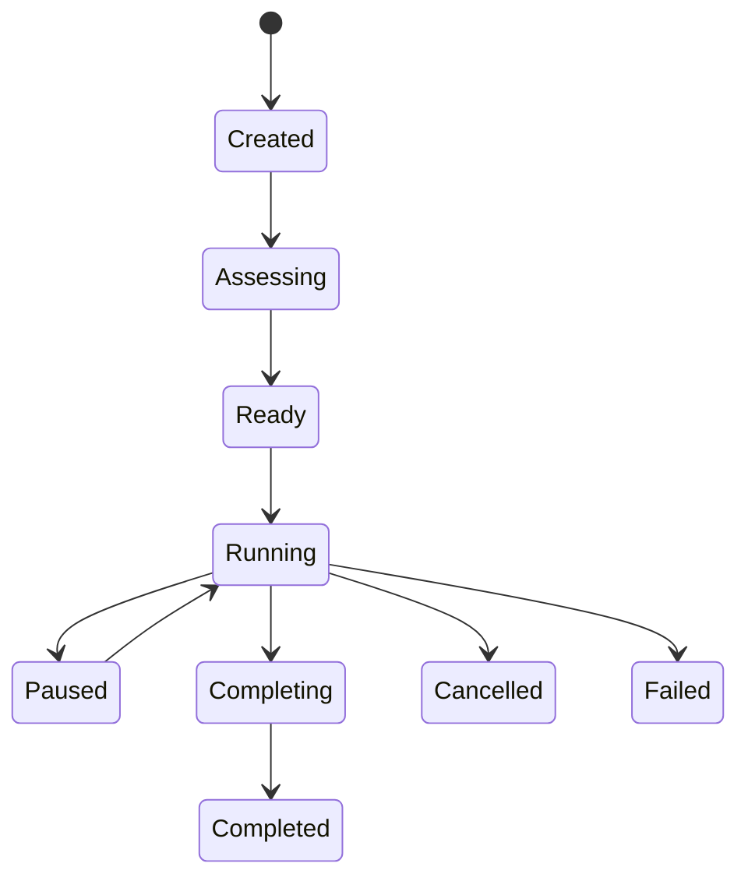

# Architecture Diagrams

## Component view

```mermaid
flowchart LR
UI[macOS UI] --> CORE[Recovery Core]
UI --> XPC[Privileged Helper]
XPC --> DEV[Read-only Device Access]
CORE --> IO[Storage I/O]
CORE --> PART[Partition Discovery]
PART --> PROBE[Filesystem Probing]
PROBE --> FAT[FAT32]
PROBE --> EXFAT[exFAT]
CORE --> CARVE[Carving]
FAT --> VAL[Validation]
EXFAT --> VAL
CARVE --> VAL
VAL --> OUT[Recovery Output]
CORE --> SESS[Session Store]
```

## Recovery flow

```mermaid
sequenceDiagram
participant U as User
participant C as Core
participant S as Source
participant P as Parser
participant V as Validator
participant O as Output
U->>C: Start scan
C->>S: Read-only bounded reads
C->>P: Analyze metadata
P-->>C: Candidates + evidence
C->>V: Validate bounded data
V-->>C: Validation result
C->>O: Recover selected candidate
O-->>U: Manifest + status
```

## Session state

```mermaid
stateDiagram-v2
[*] --> Created
Created --> Assessing
Assessing --> Ready
Ready --> Running
Running --> Paused
Paused --> Running
Running --> Completing
Completing --> Completed
Running --> Cancelled
Running --> Failed
```