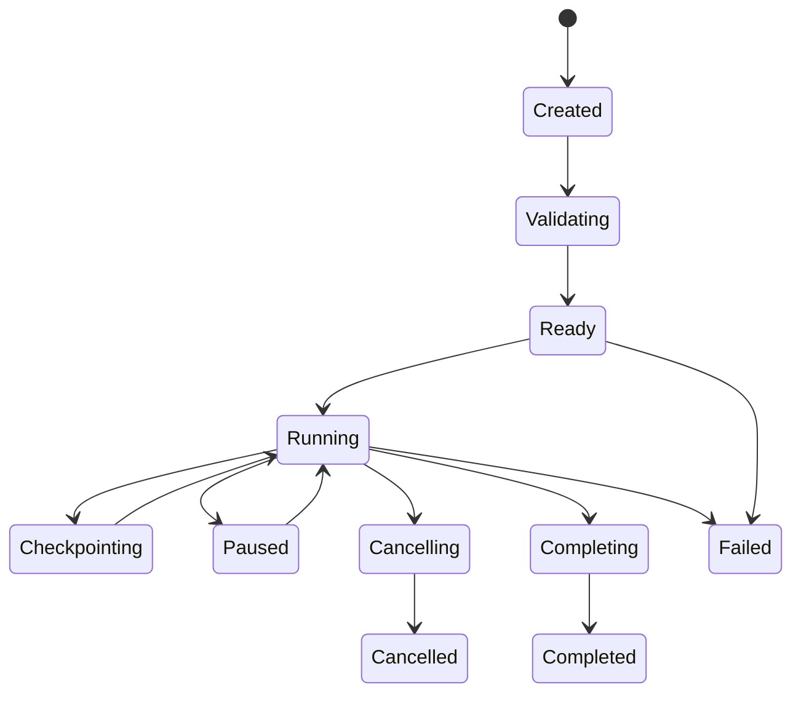

# Detailed Disk Imaging Specification

## 1. Purpose

Define the implementation contract for creating a safe, resumable forensic-style copy of a storage source without modifying that source.

Disk imaging is a recovery-support operation. It is not a substitute for recovery and does not guarantee that every unreadable byte can be recovered.

## 2. Scope

MVP:
- sequential read-only imaging
- bounded retries
- adaptive read splitting on failures
- explicit unreadable-range recording
- checkpoint and resume
- source fingerprint validation before resume
- cancellation
- destination capacity validation
- deterministic progress events

Deferred:
- compressed images
- sparse image containers with custom formats
- multi-source distributed imaging
- write-back repair

## 3. Safety Invariants

1. The source is opened through a read-only BlockDevice contract.
2. The image destination must not resolve to the same source identity.
3. Source reads are bounded by known capacity.
4. Every source byte range is either recorded as copied or represented by an explicit unreadable-range record.
5. Resume is rejected when source fingerprint evidence does not match.
6. The engine never claims unreadable bytes were successfully copied.
7. Cancellation leaves a resumable checkpoint only after metadata consistency is established.

## 4. Imaging Model

An imaging session contains:

- session ID
- source descriptor
- source fingerprint
- source capacity
- logical read geometry
- destination descriptor
- chunk policy
- completed ranges
- unreadable ranges
- retry evidence
- state
- checkpoint generation

Output consists of:

1. image byte stream or image file
2. sidecar metadata/checkpoint record

The initial MVP image is a raw byte-for-byte representation of readable source ranges.

## 5. State Machine



A terminal state is emitted once.

## 6. Source Fingerprint

The fingerprint is evidence used to reject unsafe resume. It should combine stable available properties rather than relying on a display name.

Possible evidence:
- capacity
- logical sector size
- stable device identifier when available
- selected metadata ranges hashed under explicit policy

The fingerprint policy must be versioned.

A mismatch blocks automatic resume. The user must start a new imaging session rather than continuing against a potentially different source.

## 7. Destination Validation

Before writing:

- destination must be writable
- available space must satisfy the selected imaging policy
- destination identity must differ from source identity
- destination path must be canonicalized according to platform policy
- existing partial image handling must be explicit

The imaging module must not silently overwrite an unrelated file.

## 8. Chunk Policy

A chunk policy defines:

- preferred chunk size
- minimum chunk size
- maximum retry count
- backoff policy
- read deadline where supported

The initial preferred chunk size is a configurable implementation value, not a filesystem constant.

All chunk boundaries must be clipped to source capacity.

## 9. Normal Read Path

For each pending range:

1. Check cancellation.
2. Select the next bounded chunk.
3. Attempt read.
4. On success, write exactly the returned bytes to the corresponding destination offset.
5. Flush according to durability policy.
6. Record completed range.
7. Emit progress.

The destination write offset equals the logical source offset for raw images.

## 10. Read Failure Strategy

Read errors are expected on damaged media.

Policy:

1. Retry the same range up to the bounded retry count when the error is classified as potentially transient.
2. If the range still fails and is larger than the minimum chunk size, split it into smaller subranges.
3. Process subranges independently.
4. If a minimum-sized range remains unreadable after policy exhaustion, record it explicitly as unreadable.

The engine must not loop indefinitely.

## 11. Adaptive Range Splitting

Given failing range:

```text
[offset, length]
       |
       v
split near midpoint
       |
       +--> left range
       |
       +--> right range
```

Requirements:
- split arithmetic is checked
- no zero-length child ranges
- children exactly cover the parent range
- recursion or queue depth is bounded
- work ordering remains deterministic

A queue-based implementation is preferred over unbounded recursion.

## 12. Unreadable Ranges

Each unreadable range records:

- byte range
- final error classification
- retry count
- timestamp or monotonic event sequence
- policy version

Unreadable ranges must be normalized and merged only when adjacent and evidence-compatible.

The raw output representation for unreadable bytes must be explicitly documented. The default MVP policy is to preserve output offsets while recording that corresponding bytes are unknown; consumers must consult metadata rather than treating placeholder bytes as recovered evidence.

## 13. Partial Reads

If a lower layer reports a successful partial read:

- copy only the reported bytes
- schedule the remaining suffix
- do not mark the original range complete
- prevent zero-progress loops

Repeated zero-byte success without an explicit end-of-source condition is treated as an error.

## 14. Destination Write Semantics

The imaging writer is separate from the source reader.

Required properties:
- checked output offsets
- explicit short-write handling
- atomic checkpoint metadata replacement where supported
- no silent truncation
- durability boundary documented

Destination writes may use platform APIs internally but are never exposed through the source BlockDevice contract.

## 15. Checkpointing

A checkpoint contains enough information to continue safely:

- schema version
- session ID
- source fingerprint and policy version
- destination identity/path evidence
- source capacity
- completed range set
- unreadable range set
- pending work
- retry evidence where needed
- progress counters

Checkpoint write sequence:

1. persist image data required for the checkpoint boundary
2. establish destination durability according to policy
3. write new checkpoint to temporary file
4. flush temporary metadata
5. atomically replace prior checkpoint where supported

Never mark ranges complete before the corresponding destination bytes satisfy the selected durability boundary.

## 16. Resume

Resume procedure:

1. Load and schema-validate checkpoint.
2. Validate source fingerprint.
3. Validate source capacity and geometry evidence.
4. Validate destination identity and partial image state.
5. Reconstruct pending ranges from completed and unreadable ranges.
6. Reject inconsistent range sets.
7. Continue with the current policy version only when compatibility rules permit.

Completed and unreadable ranges are terminal for that checkpoint generation unless an explicit re-read policy creates new work.

## 17. Cancellation

Cancellation is cooperative.

The engine checks:
- before each new read
- after read completion
- before destination write
- before checkpoint generation

On cancellation:
- stop scheduling new work
- finish or discard in-flight work according to defined ownership
- persist a consistent checkpoint if possible
- emit Cancelled only after the final checkpoint decision

Cancellation does not imply successful imaging.

## 18. Device Disconnect

A disconnect is a distinct failure class.

Behavior:
- stop active reads
- preserve consistent completed metadata
- checkpoint resumable state where possible
- emit diagnostic evidence
- transition to Paused/Failed according to platform policy

Automatic resume after reconnect requires fingerprint validation.

## 19. Progress Model

Progress values include:

- total source bytes
- readable bytes copied
- bytes classified unreadable
- bytes pending
- retry count
- current range

The UI must not infer completion solely from copied bytes. A session can complete with unreadable ranges.

Progress invariant:

completed + unreadable + pending = total

after normalization under the session's range accounting model.

## 20. Error Taxonomy

Examples:

- IMG_001 SourceReadFailed
- IMG_002 DestinationWriteFailed
- IMG_003 DestinationInsufficientSpace
- IMG_004 SourceFingerprintMismatch
- IMG_005 InvalidCheckpoint
- IMG_006 RangeOverflow
- IMG_007 ZeroProgressRead
- IMG_008 DeviceDisconnected
- IMG_009 SourceDestinationConflict
- IMG_010 CheckpointDurabilityFailed
- IMG_011 RetryBudgetExhausted

Errors and diagnostics remain typed; implementation must not depend on matching human-readable strings.

## 21. Recovery Engine Integration

The recovery engine can request imaging when source assessment indicates instability.

Policy flow:

```text
Source assessment
       |
       +--> stable ----> scan source
       |
       +--> unstable --> recommend image-first
                              |
                              v
                        imaging session
                              |
                              v
                      scan image as source
```

The recovery engine must preserve the distinction between evidence obtained from the original source and from an image with unreadable ranges.

## 22. API Shape

Conceptually:

```text
start_imaging(request) -> ImagingSession

resume_imaging(checkpoint) -> ImagingSession

ImagingSession:
    poll_events()
    cancel()
    checkpoint()
```

The concrete API must provide:
- typed events
- deterministic terminal states
- explicit ownership of source and destination handles

## 23. Concurrency

The initial MVP may use one reader pipeline per source.

Parallel reads must not be added until:
- ordering semantics are specified
- device stress behavior is measured
- checkpoint range accounting is proven correct

Parallel destination writes require independent offset safety and deterministic error handling.

Correctness is more important than throughput in the initial implementation.

## 24. Testing Requirements

### Unit tests
- valid chunk progression
- final partial chunk
- retry success
- retry exhaustion
- split-on-failure
- minimum-size unreadable range
- partial-read suffix scheduling
- zero-progress detection
- range normalization

### Integration tests
Generated file images with fault injection:
- transient failures
- permanent bad ranges
- disconnect during imaging
- cancellation and resume
- checkpoint corruption
- source fingerprint mismatch
- destination write failure

### Property tests
Generate capacities, chunk sizes and failing ranges.

Assert:
- no out-of-bounds reads
- child split ranges exactly cover parents
- accounting invariant holds
- no range is both completed and pending
- arithmetic never panics

### Fuzzing
Fuzz:
- checkpoint metadata
- range-set decoding
- corrupted session records

## 25. Milestone Acceptance Criteria

Disk imaging support is implementation-ready when:

- successful reads preserve correct logical offsets
- unreadable ranges are explicitly represented
- retries are bounded
- adaptive splitting terminates
- cancellation creates a consistent terminal outcome
- resume rejects mismatched sources
- checkpoint corruption is handled safely
- source and destination conflict is rejected
- all fault-injection tests pass
- no source-write operation is introduced

## 26. Implementation Order

1. Imaging domain types and range accounting.
2. Destination validation contract.
3. Sequential happy-path image copy.
4. Checkpoint model.
5. Resume validation.
6. Retry policy.
7. Adaptive range splitting.
8. Unreadable-range recording.
9. Cancellation.
10. Fault-injection integration tests.
11. Checkpoint corruption and property tests.

Do not add parallel imaging until the sequential implementation satisfies the acceptance criteria.
