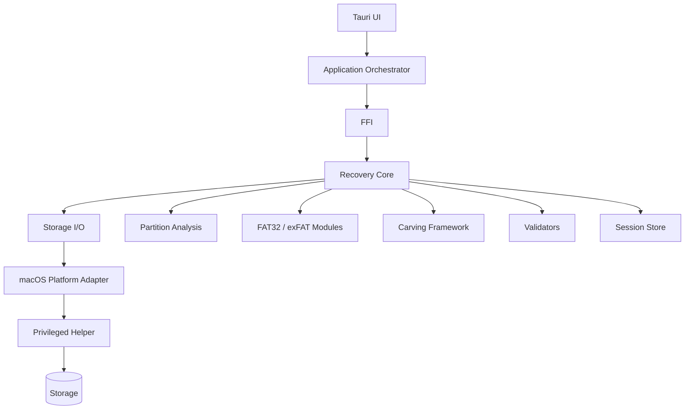

# Component Architecture

```mermaid
flowchart TB
 UI[Tauri UI] --> APP[Application Orchestrator]
 APP --> FFI[FFI]
 FFI --> CORE[Recovery Core]
 CORE --> IO[Storage I/O]
 CORE --> PART[Partition Analysis]
 CORE --> FS[FAT32 / exFAT Modules]
 CORE --> CARVE[Carving Framework]
 CORE --> VAL[Validators]
 CORE --> STORE[Session Store]
 IO --> ADAPTER[macOS Platform Adapter]
 ADAPTER --> XPC[Privileged Helper]
 XPC --> DEV[(Storage)]
```

Dependency rule: UI depends inward; parsers and storage modules never depend on UI.