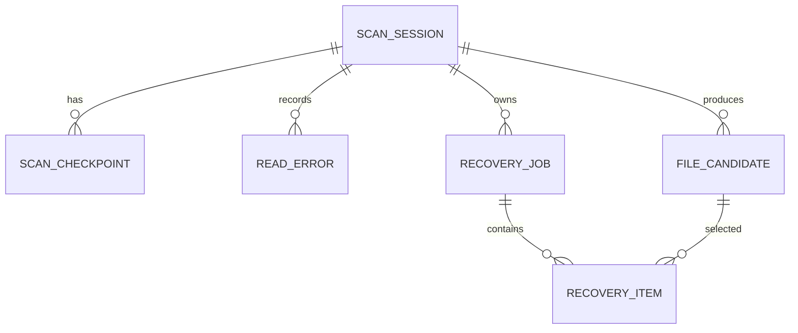

# Database ER Diagram

```mermaid
erDiagram
 SCAN_SESSION ||--o{ SCAN_CHECKPOINT : has
 SCAN_SESSION ||--o{ READ_ERROR : records
 SCAN_SESSION ||--o{ FILE_CANDIDATE : produces
 SCAN_SESSION ||--o{ RECOVERY_JOB : owns
 RECOVERY_JOB ||--o{ RECOVERY_ITEM : contains
 FILE_CANDIDATE ||--o{ RECOVERY_ITEM : selected
```

Foreign keys and indexes are finalized with the concrete persistence implementation.