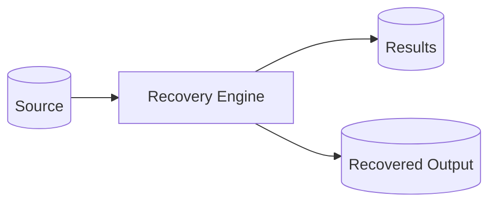
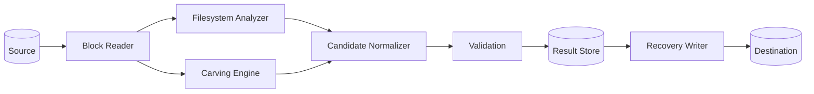

# Data Flow Diagrams

## Level 0

```mermaid
flowchart LR
 S[(Source)] --> E[Recovery Engine]
 E --> R[(Results)]
 E --> O[(Recovered Output)]
```

## Level 1

```mermaid
flowchart LR
 S[(Source)] --> B[Block Reader]
 B --> F[Filesystem Analyzer]
 B --> C[Carving Engine]
 F --> N[Candidate Normalizer]
 C --> N
 N --> V[Validation]
 V --> RS[(Result Store)]
 RS --> W[Recovery Writer]
 W --> D[(Destination)]
```

No arrow from any recovery component to the source represents a write operation.