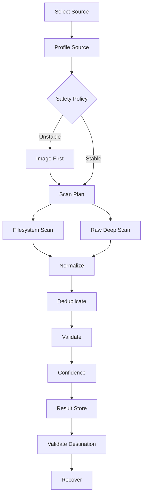

# Recovery Pipeline

```mermaid
flowchart TD
 SRC[Select Source] --> PROF[Profile Source]
 PROF --> SAFE{Safety Policy}
 SAFE -->|Unstable| IMG[Image First]
 IMG --> PLAN[Scan Plan]
 SAFE -->|Stable| PLAN
 PLAN --> Q[Filesystem Scan]
 PLAN --> D[Raw Deep Scan]
 Q --> NORM[Normalize]
 D --> NORM
 NORM --> DEDUP[Deduplicate]
 DEDUP --> VAL[Validate]
 VAL --> CONF[Confidence]
 CONF --> RES[Result Store]
 RES --> DEST[Validate Destination]
 DEST --> REC[Recover]
```