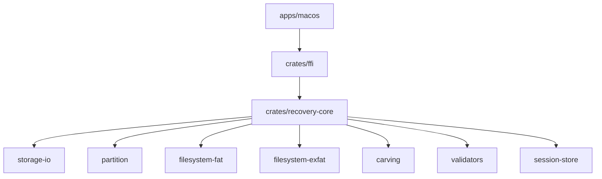

# Repository Architecture

```text
data-recovery/
├── apps/
│   └── macos/
├── crates/
│   ├── recovery-core/
│   ├── storage-io/
│   ├── partition/
│   ├── filesystem-fat/
│   ├── filesystem-exfat/
│   ├── carving/
│   ├── validators/
│   ├── session-store/
│   └── ffi/
├── tests/
│   ├── corpus/
│   ├── integration/
│   └── fixtures/
├── docs/
└── scripts/
```

