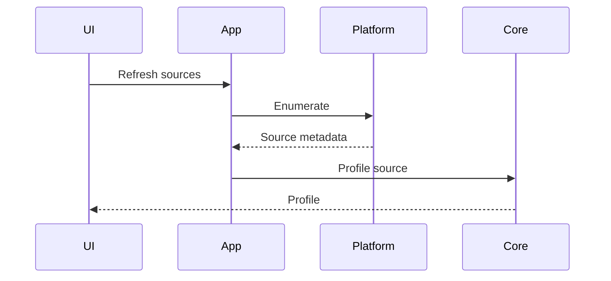
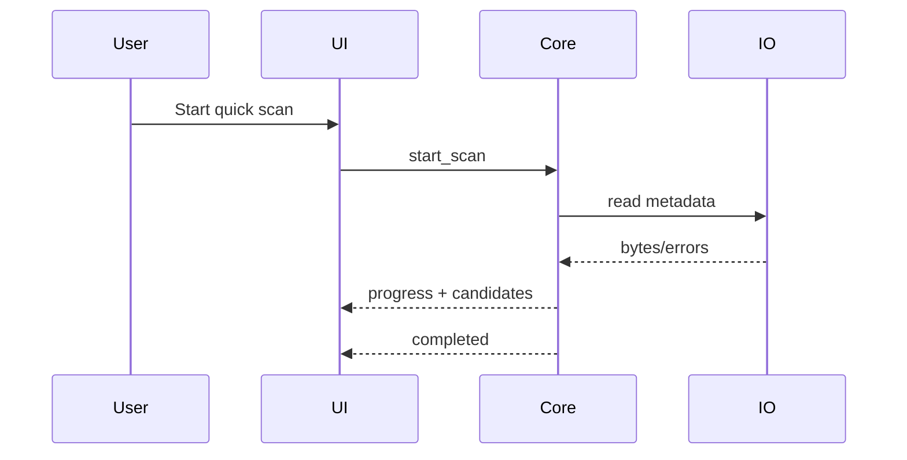
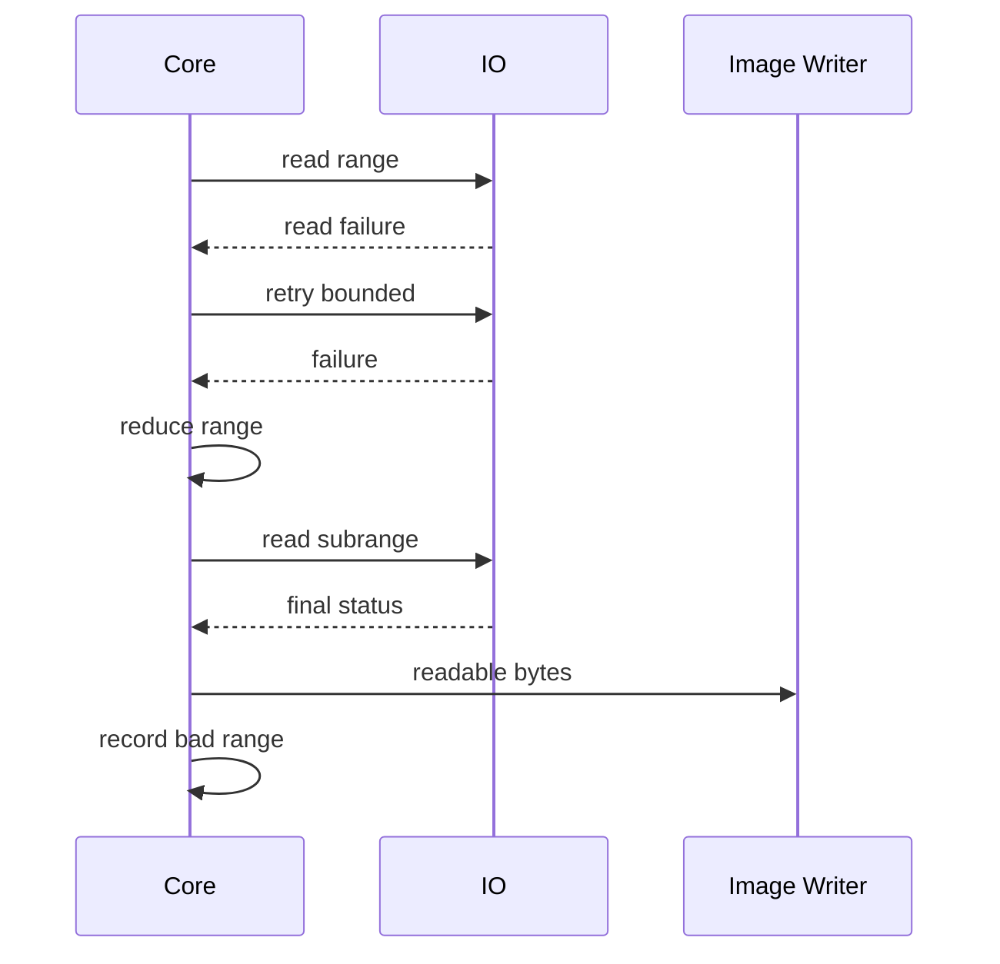
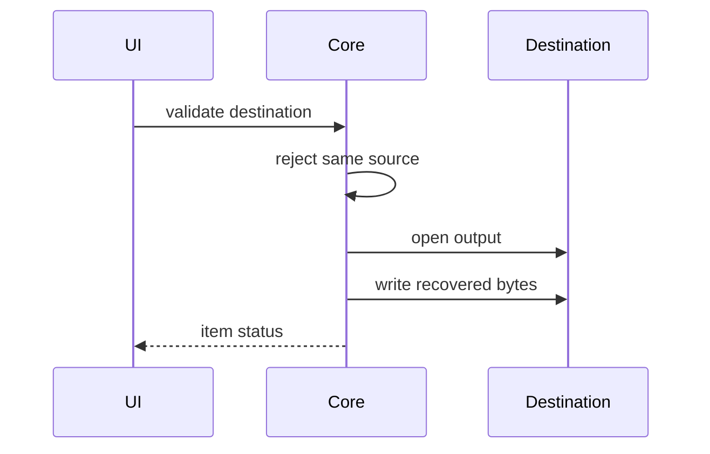

# Sequence Diagrams

## Device discovery

```mermaid
sequenceDiagram
 participant UI
 participant App
 participant Platform
 participant Core
 UI->>App: Refresh sources
 App->>Platform: Enumerate
 Platform-->>App: Source metadata
 App->>Core: Profile source
 Core-->>UI: Profile
```

## Quick scan

```mermaid
sequenceDiagram
 participant U as User
 participant UI
 participant Core
 participant IO
 U->>UI: Start quick scan
 UI->>Core: start_scan
 Core->>IO: read metadata
 IO-->>Core: bytes/errors
 Core-->>UI: progress + candidates
 Core-->>UI: completed
```

## Imaging with read failure

```mermaid
sequenceDiagram
 participant Core
 participant IO
 participant W as Image Writer
 Core->>IO: read range
 IO-->>Core: read failure
 Core->>IO: retry bounded
 IO-->>Core: failure
 Core->>Core: reduce range
 Core->>IO: read subrange
 IO-->>Core: final status
 Core->>W: readable bytes
 Core->>Core: record bad range
```

## Recovery

```mermaid
sequenceDiagram
 participant UI
 participant Core
 participant D as Destination
 UI->>Core: validate destination
 Core->>Core: reject same source
 Core->>D: open output
 Core->>D: write recovered bytes
 Core-->>UI: item status
```