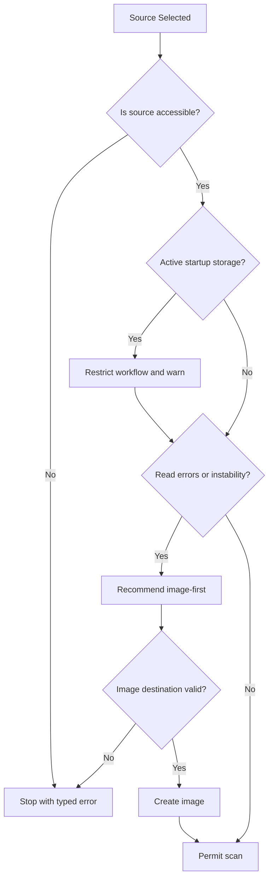

# Source Safety Decision Tree

```mermaid
flowchart TD
 A[Source Selected] --> B{Is source accessible?}
 B -->|No| X[Stop with typed error]
 B -->|Yes| C{Active startup storage?}
 C -->|Yes| W[Restrict workflow and warn]
 C -->|No| D{Read errors or instability?}
 W --> D
 D -->|Yes| I[Recommend image-first]
 D -->|No| S[Permit scan]
 I --> V{Image destination valid?}
 V -->|No| X
 V -->|Yes| IMG[Create image]
 IMG --> S
```

Recovery destination validation is a separate mandatory gate and blocks source==destination.