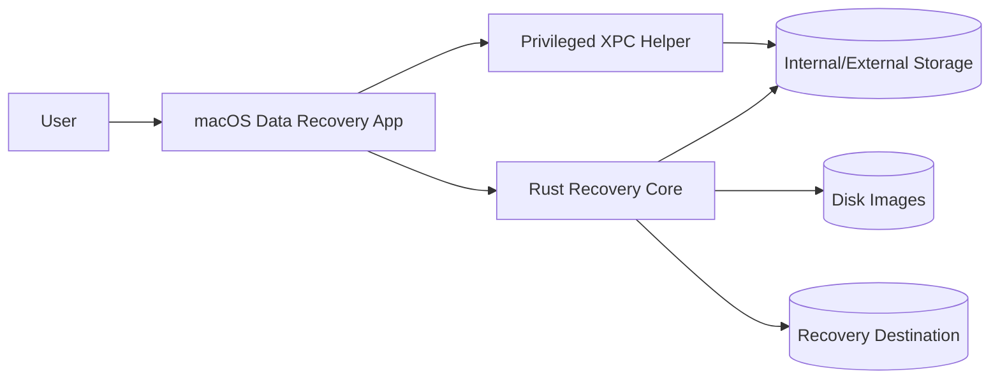

# System Context Diagram

```mermaid
flowchart LR
 U[User] --> A[macOS Data Recovery App]
 A --> X[Privileged XPC Helper]
 A --> R[Rust Recovery Core]
 R --> S[(Internal/External Storage)]
 R --> I[(Disk Images)]
 R --> D[(Recovery Destination)]
 X --> S
```

The source media is untrusted input. Recovery output always targets a separately validated destination.