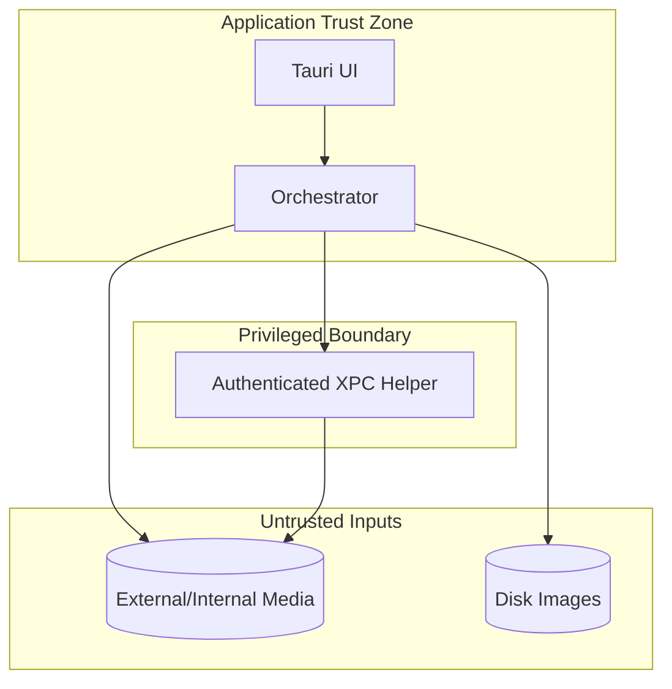

# Trust Boundaries

```mermaid
flowchart TB
 subgraph Trusted["Application Trust Zone"]
 UI[Tauri UI]
 APP[Orchestrator]
 end
 subgraph Priv["Privileged Boundary"]
 XPC[Authenticated XPC Helper]
 end
 subgraph Untrusted["Untrusted Inputs"]
 DEV[(External/Internal Media)]
 IMG[(Disk Images)]
 end
 UI --> APP
 APP --> XPC
 APP --> DEV
 APP --> IMG
 XPC --> DEV
```

All filesystem metadata, file content, device labels and image bytes are untrusted.