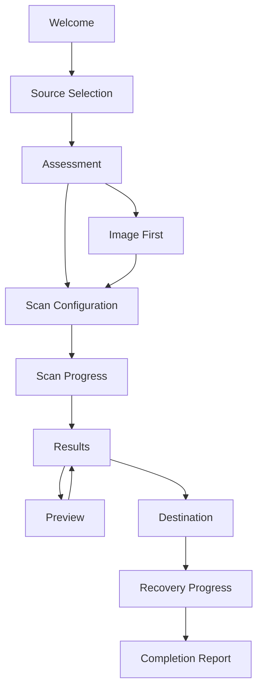

# UI Navigation Flow

```mermaid
flowchart TD
 W[Welcome] --> S[Source Selection]
 S --> A[Assessment]
 A --> C[Scan Configuration]
 A --> I[Image First]
 I --> C
 C --> P[Scan Progress]
 P --> R[Results]
 R --> V[Preview]
 V --> R
 R --> D[Destination]
 D --> RP[Recovery Progress]
 RP --> DONE[Completion Report]
```

Safety warnings are modal only when an explicit decision is required.